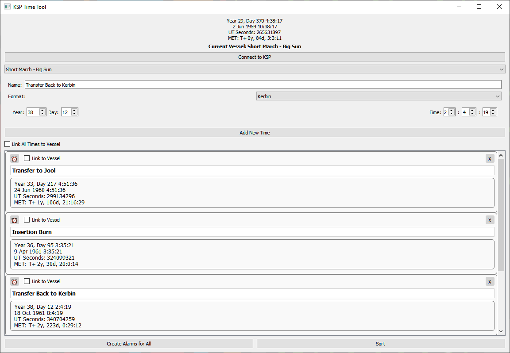

# KSP Time Tool

This is a simple tool for converting between the different time formats and setting alarms in Kerbal Space Program. You can use it with [kRPC](https://forum.kerbalspaceprogram.com/topic/130742-112x-krpc-control-the-game-using-c-c-java-lua-python-ruby-haskell-c-arduino-v054/) to connect to a running instance of KSP (using the default KRPC server configuration on localhost only for now), or use it as a standalone calculator. If you connect it to your game instance, you'll be able to set in-game alarms from KSP Time Tool.

I made this primarily as a tool for myself because there are some really excellent tools out there for planning transfers and setting maneuvers, like [alexmoon's wonderful KSP Launch Window Planner](https://alexmoon.github.io/ksp), [Krapfy's impressive KSP-MGA-Planner](https://krafpy.github.io/KSP-MGA-Planner/) for planning gravity assists, as well as many mods like [Precise Node](https://forum.kerbalspaceprogram.com/topic/161855-112x-precise-node-continued-precisely-edit-your-maneuver-nodes/) and [MechJeb](https://forum.kerbalspaceprogram.com/topic/154834-112x-anatid-robotics-mumech-mechjeb-autopilot-2143-4th-march-2023/), among many others. These tools are great, but some use Kerbin date format, others use UT dates, and still others use UT seconds for input. I was spending a lot of time converting time units and alt-tabbing between the game and my browser to copy numbers across from one screen to the other. So I made this tool to simplify my life a little bit. In particular, this has made it easier to do the workflow of entering my current vessel's orbital information into KSP Window Planner to calculate a transfer (with times converted to Kerbin dates) and then input the maneuver parameters and time (converted to UT seconds) into Precise Node, and then create an alarm for myself.



## Usage

Install the `ksp_time_tool` Python module or build and run it locally.

You can install the module with pip:
```console
pip install ksp-time-tool
```

Once installed, run

```console
python -m ksp_time_tool.pyqt_gui.tool_gui
```

You can run it locally by cloning the directory, setting your working directory to `python/src` and then running the command above. You'll have to make sure that you have compatible versions of the [KRPC Python client](https://pypi.org/project/krpc/) and [PyQT5](https://pypi.org/project/PyQt5/) installed. To connect with the game, make sure that KSP is running and that you have an active kRPC server with default settings running in the game. You can still use the calculator features without the kRPC mod installed in your game or even having the game running, but you will not be able to select a vessel, set alarms, or view your in-game time and Mission Elapsed Times (MET).

## Future Ideas

I threw this together over a weekend, so I didn't get to everything I thought of as I was making this. Some future ideas for improvements include:

* Allowing you to set maneuvers programmatically from KSP Time Tool by linking a time to prograde, normal, and radial $∆v$. This seems easy enough to do it. I just need to think of how I want to change the GUI to accomodate this. It will probably be a very minimal change using the currently empty space on the right hand side of the time list cards for contextual input fields.

* Allowing custom KRPC connections, including remote hosts and non-default ports. I'm thinking this could be cool if, for example, you are playing with friends using a mod like [Houston](https://forum.kerbalspaceprogram.com/topic/118867-104-houston-v100-a-mission-control-ui-for-telemachus/) and you want to generate alarms and maneuvers for their game.

* Syncing alarms and maneuvers. Right now you can only add alarms to a KSP host. You can't view or modify alarms that are already set.

* Importing and exporting alarms and maneuvers to file.

* A C# client.
